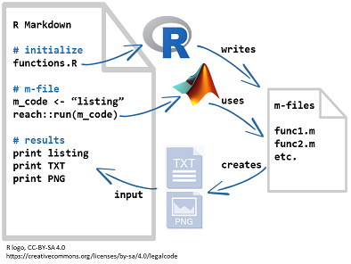

# r-matlab-toolbox

In this toolbox, I'm experimenting with the [`reach`](https://github.com/schmidtchristoph/reach) package (by Christoph Schmidt) for R, developing tools to use R Markdown to create course materials that include MATLAB syntax and output. My goal is to gradually improve the reproducibility of my course source files.

The figure illustrates how I orchestrate the interaction between R and MATLAB. I discuss the approach in greater detail in a [blog post](http://www.graphdoctor.com/archives/1216). 

  
## tools 

- [functions.R](scripts/functions.R) 
- [Bode plot](scripts/03_bode.md) [(template)](scripts/template_bode.Rmd) 
- [Step response](scripts/04_step.md) [(template)](scripts/template_step.Rmd) 

## explorations 

- [First test case: Bode plot](scripts/01_bode_test.md) 
- [Using R to write a MATLAB function](scripts/02_functions.md) 

## references 

1. Christoph Schmidt (2016) *reach*, GitHub repository, https://github.com/schmidtchristoph/reach. 
2. Jesse Hopkins (2009) *genpath\_exclude.m*, MathWorks File Exchange, https://www.mathworks.com/matlabcentral/fileexchange/22209-genpath-exclude. 

--- 
[License](LICENSE.md)
