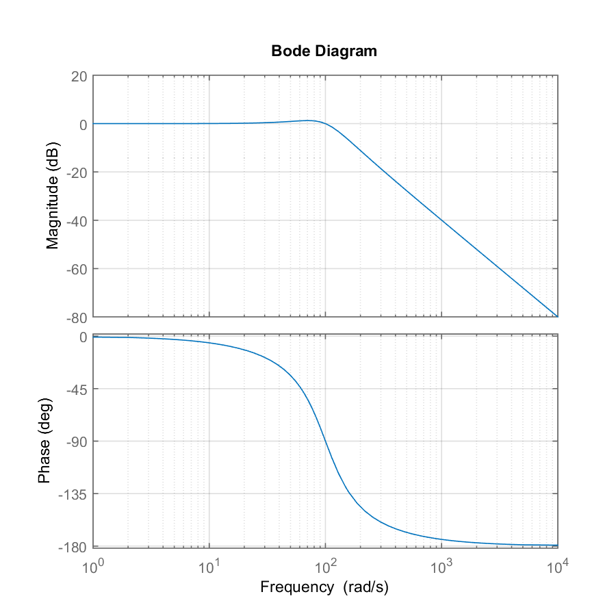

# bode plot

This example is about using the MATLAB `bode()` function. 

The approach I've worked up here is to write an m-script in an R code chunk, have MATLAB run the code and save the outputs, and read the outputs into the R Markdown environment to create the course document. 

 

## managing files 

I use relative file paths with respect to the RStudio Project working directory. My examples require a file structure that includes:  

```
project\
  |-- derived\
  |-- results\
  |-- scripts\
  `-- project.Rproj
```

I open an Rmd script and save it in the `scripts\` directory. 


## getting started 

I set the `knitr` working directory to match the project working directory. 

```{r echo = 1:2}
library(knitr)
opts_knit$set(root.dir = "../")
opts_chunk$set(echo = FALSE, comment = NA, message = FALSE, warning = FALSE, collapse = FALSE, fig.keep = 'high')
```

Load the packages. 

```{r echo = TRUE}
library(readr)
library(stringr)
library(reach)
library(R.matlab)
```

The string variable `add_to_path` (below) contains the MATLAB commands to add the project folders to the MATLAB search path.

```{r echo = TRUE, eval = FALSE}
m_script <- "pathstr = [cd]; 
  addpath(genpath(pathstr), '-end'); 
  savepath;" 
reach::runMatlabCommand(m_script)
```

The header for this code chunk includes the knitr option `eval = FALSE`. If MATLAB indicates a path problem, e.g., `Warning: Name is nonexistent or not  directory...`, then I manually run the code chunk a time or two until the path message clears up. 

 

## authoring MATLAB code in the R script  

This R code chunk contains the MATLAB script, surrounded by a single set of quotes and assigned to object `m_script`. 

```{r echo = TRUE}
m_script <- "% assign parameters
K  = 5;
wn = 10; 
z  = 0.05;

% create the transfer function 
n = K;
d = [1/wn^2  2*z/wn  1];
sys = tf(n, d);

% compute and plot the frequency response
bode(sys)
grid
"# end m-file
```

To run the script in MATLAB: 

```{r echo = TRUE, eval = FALSE}
reach::runMatlabCommand(m_script)
Sys.sleep(0)
```

Running this script, a MATLAB command window opens, the graph opens and closes, and the command window closes. The `Sys.sleep(0)` function has no effect here (set to 0 seconds) but will be used later. 

Next we add some housekeeping code to be able to save the MATLAB output.


## writing MATLAB output to file

Add new lines to the `m_script` string following the `bode(sys)` line, starting with comment `% break`. 

- Lines above the break comment will be printed in the output document (code I want students to see and use); lines below are not. 
- the `% write sys to txt` chunk saves the transfer function `sys` to `'results/sys_tf.txt'` 
- the `% write gcf to png` chunk saves the graph to `'results/m01_bode.png'` 

```{r echo = TRUE}
# MATLAB commands for a bode plot
m_script <- "% assign parameters
K  = 5;
wn = 10;
z  = 0.05; 

% create the transfer function 
n = K;
d = [1/wn^2  2*z/wn  1];
sys = tf(n, d);

% compute and plot the frequency response
bode(sys)
grid

% print_stop

% write sys to txt
fid = fopen('results/sys01.txt', 'wt');
sys_string = evalc('sys');
fprintf(fid, sys_string);
fclose(fid);

% write gcf to png
fig = gcf;
fig.PaperUnits    = 'inches';
fig.PaperPosition = [0 0 4 4];
saveas(fig, 'results/m01_bode.png');
"# end m-file
```

After knitting the document, the results directory has two files.  

```
results\
  |-- sys01.txt
  `-- m01_bode.png
```

```{r eval = TRUE}
# execute the m-file for first run or if changed 
saveRDS(m_script, "derived/new.rds")
if (!file.exists("derived/old.rds")) {
  saveRDS(" ", "derived/old.rds")
}
newrds <- readRDS("derived/new.rds")
oldrds <- readRDS("derived/old.rds")
if (!identical(oldrds, newrds)) {
  saveRDS(m_script, "derived/old.rds")
  reach::runMatlabCommand(m_script)
  Sys.sleep(12)
}
```


## printing the MATLAB code 

I use `str_split()` from the `stringr` package to separate the MATLAB commands at the `% print_stop` comment and print the upper half of the code to the output document for student use. 

```{r echo = TRUE, results='hide'}
if (str_detect(m_script, "% print_stop")) {
  code_for_students <- str_split(m_script, "% print_stop", n = 2)[[1]][1]
} else {
  code_for_students <- m_script
}
cat(code_for_students)
```

The output printed to the document is:  

```{r}
cat(code_for_students)
```


## pause before reading 

Before reading the files from `results\` to place them in the Rmd output document, I edit `Sys.sleep()` to pause R execution for 12 seconds (your mileage may vary) to give MATLAB time to write outputs to file before R reads those files. 

The revised code chunk for running MATLAB:

```{r echo = TRUE, eval = FALSE}
reach::runMatlabCommand(m_script)
Sys.sleep(12)
```


## printing the transfer function 

Read the MATLAB transfer function expression with `read_lines()` from the `readr` package. Select specific lines and print with `cat()`. 

```{r echo = TRUE}
sys <- read_lines('results/sys01.txt', skip = 3, n_max = 3)
cat(sys, sep = "\n")
```

Or I can get fancy and  pretty-print the transfer function,  

```{r echo = TRUE}
# trim spaces and isolate the numerator and denominator 
Gs  <- str_trim(sys)
num <- Gs[1]
den <- Gs[3]
```

using inline code chunks in a math expression, 

<pre class="r"><code>$$
G(s) = \frac{<code>`</code>r num<code>`</code>}{<code>`</code>r den<code>`</code>}
$$</code></pre>

Sadly, this syntax does not render properly when the R Markdown output format is set to `github_document`. However, it does render correctly to HTML, PDF, and Word output formats. 


## printing the bode plot

The frequency response graph is obtained by reading the PNG file. Note that because `include_graphics()`  does not honor the  `root.dir = "../"` option set earlier, the path to the file name has to go up one level before finding the `results` directory. 

```{r echo = TRUE}

```


## speeding up the run time

Executing the MATLAB script is necessary only if the m-script changes. I can save run time by checking if the m-script has changed since the last time it was run. 

This code chunk runs the MATLAB script for the first pass or if the MATLAB code has been changed.  This chunk replaces the earlier lines `runMatlabCommand(m_script)` and `Sys.sleep(12)`. I still need the pause, but only when the m-file has been changed. 

The `Sys.sleep(0)` function allows R to temporarily be given very low priority and hence not to interfere with more important foreground tasks. A typical use is to allow a process launched from R to set itself up and read its input files before R execution is resumed.

```{r eval = FALSE, echo = TRUE}
# save current version of m-script
saveRDS(m_script, "derived/new.rds")

# create an empty RDS on the first pass
if (!file.exists("derived/old.rds")) {
	saveRDS(" ", "derived/old.rds")
}

# run MATLAB if old and new differ
newrds <- readRDS("derived/new.rds")
oldrds <- readRDS("derived/old.rds")
if (!identical(oldrds, newrds)) {
	saveRDS(m_script, "derived/old.rds")
  runMatlabCommand(m_script)
  Sys.sleep(12)
}
```

## session info

```{r}
library(devtools)
session_info()
```

--- 
[main page](../README.md)
