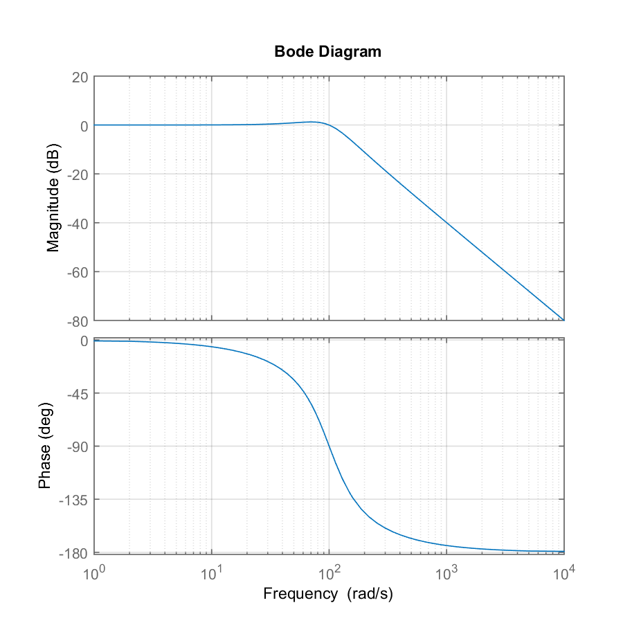

# bode plot

Requires `functions.R` and a directory structure that includes: 

```
project\
  |-- derived\
  |-- results\
  |-- scripts\
  `-- project.Rproj
```

## initialize

Create an Rmd script in `scripts/`. Initialize knitr. 

```{r 03-01, echo = TRUE}
library(knitr)
opts_knit$set(root.dir = "../")
opts_chunk$set(echo = TRUE, comment = NA, message = FALSE)
```

Sourcing `functions.R ` loads my R functions and writes user-defined MATLAB functions to file in the `derived/`  directory. 

```{r 03-02}
source('scripts/functions.R')
```


## m-file 

Write the m-file. 

The optional comment `% print_stop` separates lines above for printing (code I want students to see) from lines below (concealed from students) when printing code using `print_mfile()`. 

```{r 03-03}
# MATLAB commands for a bode plot
m_script <- "% assign parameters
K  = 10;
wn = 100;
z  = 0.5;

% create the transfer function
n = K;
d = [1/wn^2  2*z/wn  1];
sys = tf(n, d);

% compute and plot the frequency response
bode(sys)
grid

% print_stop 

% save results
write_sys(sys, 'results/sys03.txt')
write_gcf(gcf, 'results/m03_bode.png', 6, 6)
"# end m-file
```

Run the m-file. 

The function `run_mfile()` launches MATLAB only if the code has changed since the last run or if this run is the first. To force the code to run, delete the `derived/old.rds` file (if it exists).  

```{r 03-04}
# run the m-file if necessary
run_mfile(m_script, prefix = "m03")
```

If, when running MATLAB from R, the Command window shows a "path" warning, run `set_path()`. 

## results 

Finally, print the code I want students to see,  the transfer function,  and the Bode plot.  

```{r 03-05}
# print the m-file up to the line % print_stop
print_mfile(m_script)

# print the sys tfansfer function from tf()
print_sys('results/sys03.txt')

# print the graph

```


## session info

```{r 03-06}
library(devtools)
session_info()
```

--- 
[main page](../README.md)
