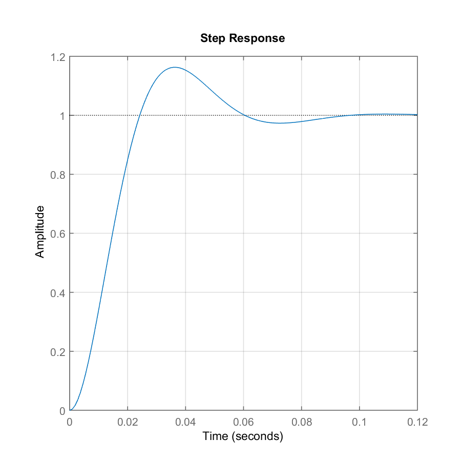

```{r echo = TRUE}
library(knitr)
opts_knit$set(root.dir = "../")
opts_chunk$set(echo = TRUE, comment = NA, message = FALSE)
```

```{r}
source('scripts/functions.R')
```

```{r}
m_script <- "% assign parameters
K  = 1;
wn = 100;
z  = 0.5;

% create the transfer function
n = K;
d = [1/wn^2  2*z/wn  1];
sys = tf(n, d);

% compute and plot the frequency response
step(sys)
grid

% print_stop 

% save results
write_sys(sys, 'results/template_step.txt')
write_gcf(gcf, 'results/template_step.png', 6, 6)
"# end m-file

run_mfile(m_script, "template_step")
```

```{r}
print_mfile(m_script)
print_sys('results/template_step.txt')

```

